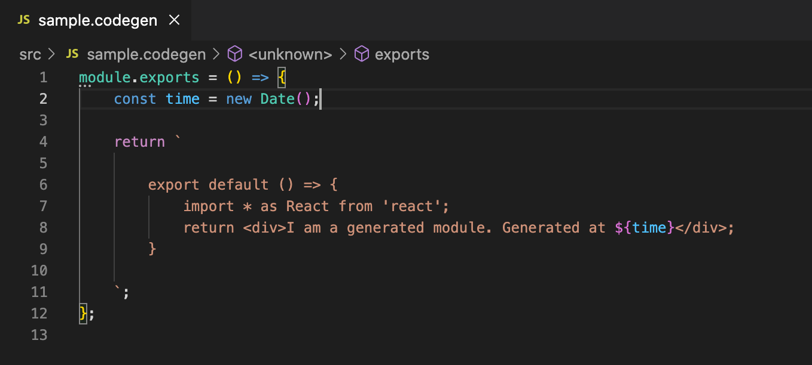

# `vscode-codegen`

[](https://marketplace.visualstudio.com/items?itemName=florianrappl.vscode-codegen) [](https://open-vsx.org/extension/florianrappl/vscode-codegen) [](https://github.com/FlorianRappl/codegen-js/actions/workflows/node.js.yml) [](https://github.com/FlorianRappl/codegen-js/releases) [](https://github.com/FlorianRappl/codegen-js/issues) [](https://github.com/FlorianRappl/codegen-js/blob/main/LICENSE)

The official VS Code extension for codegen files.

Available in the following marketplaces:

- [VS Code Marketplace](https://marketplace.visualstudio.com/items?itemName=florianrappl.vscode-codegen) for VS Code
- [Open VSX](https://open-vsx.org/extension/florianrappl/vscode-codegen) for VSCodium, code-server and Eclipse Theia

## Prerequisites

You'll need **Node.js (v16+)** with **npm (v8+)** installed for using the extension.

The extension works on all OS where VS Code is running.

## Overview

This extension is a useful companion when developing web apps with bundlers that require dynamic build-time generated files.

## Features

Right now the following features are part of this extension:

- A provider for `.codegen` files (essentially using JavaScript as language)
- Snippets to scaffold new codegen files efficiently

### Codegen Support

With this extension you'll get support for `*.codegen` files. This boils down to getting JS support associated with such files.



## Development

### Installation

Clone the repository and install the dependencies using `npm`:

```sh
npm i
```

Then open VS Code (`code .`) and run it using `F5`.

### Publish

For publishing the official command line tool `vsce` should be used.

```sh
vsce package
vsce publish -p <token>
```

This will package the current version of the repository and publish it. Make sure to have the right token specified. Follow the [instructions outlined here](https://code.visualstudio.com/api/working-with-extensions/publishing-extension#get-a-personal-access-token) to get a new one.
